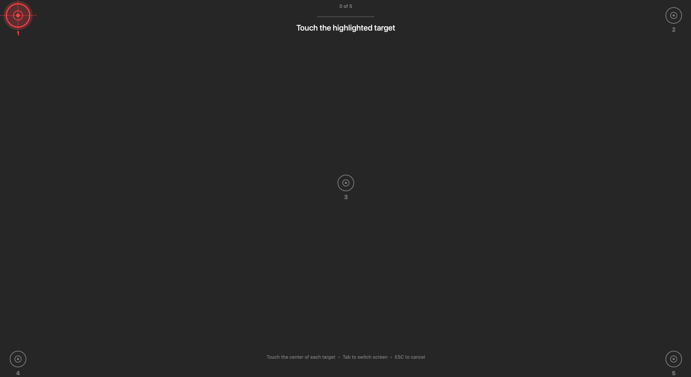
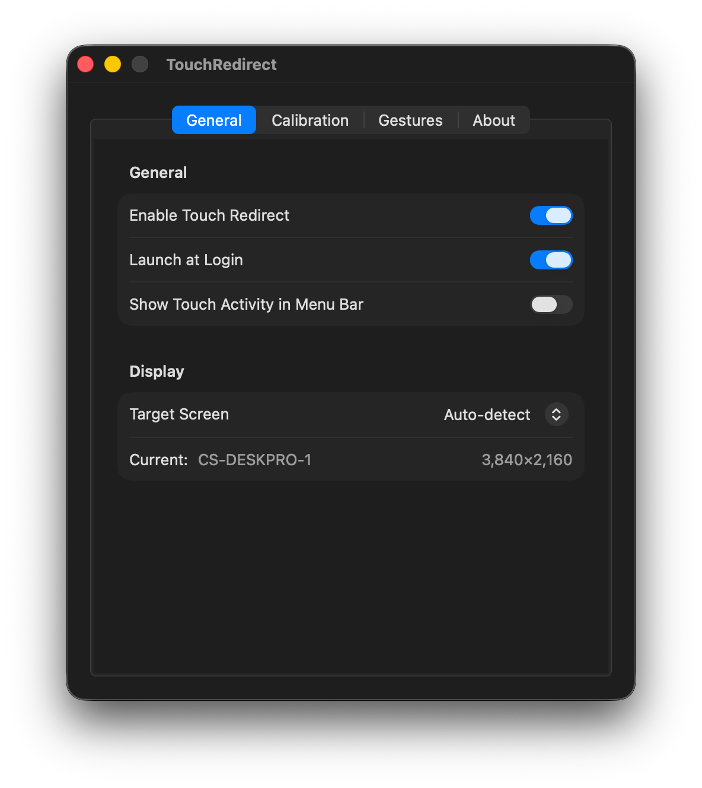
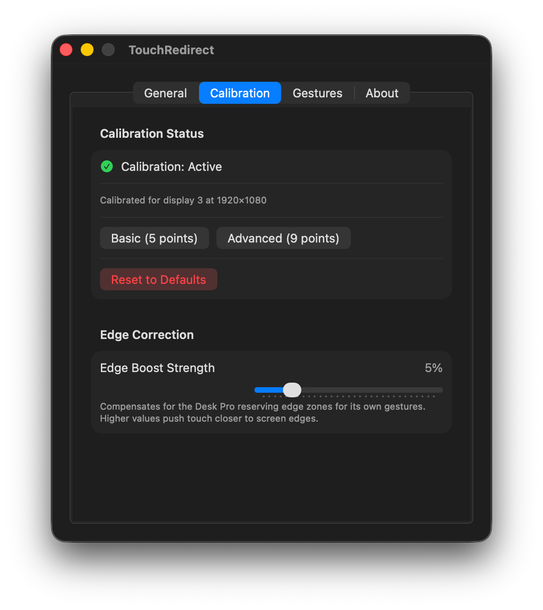
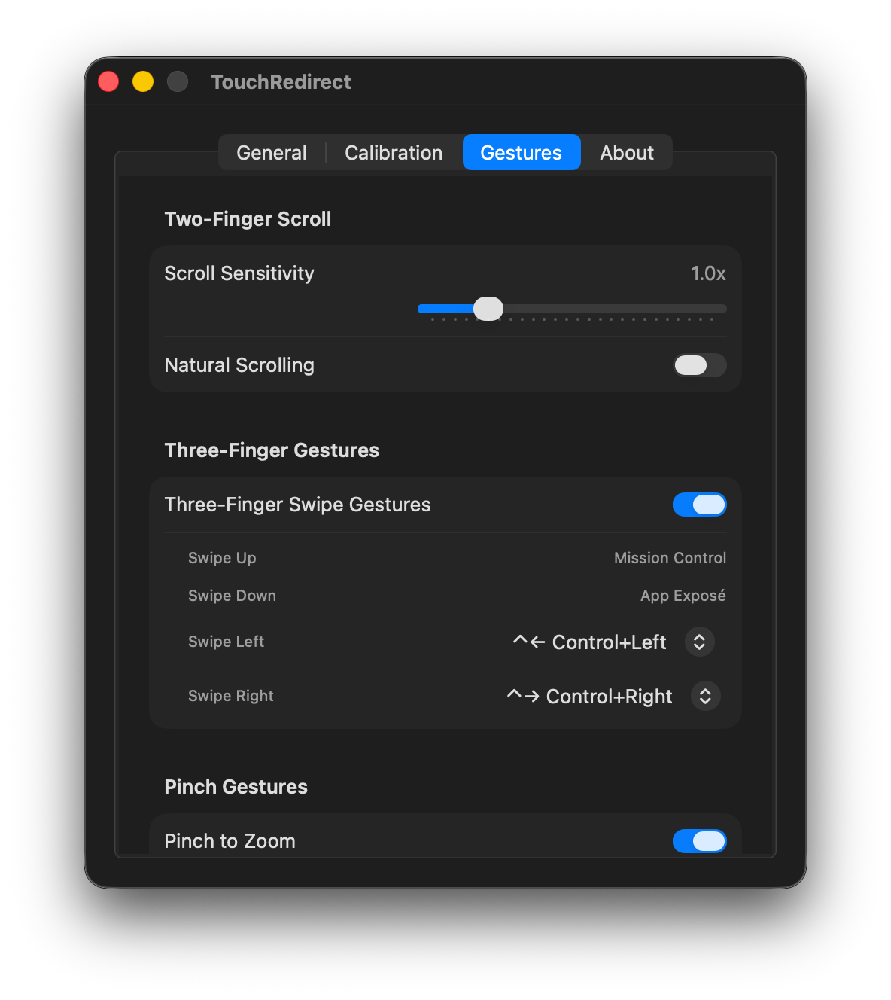
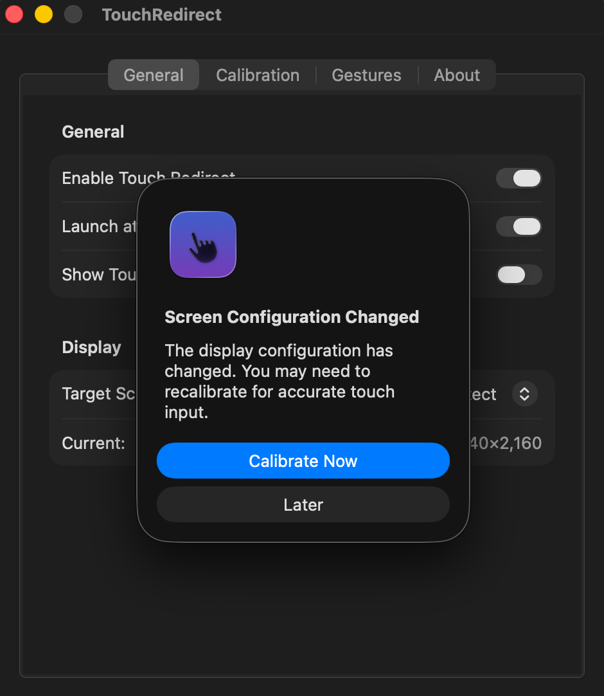

# Touch Redirect for macOS


A native macOS app that enables touch input to control your Mac via USB-C alone. I built it for the Cisco WebEx Desk Pro but designed it so support for other USB HID touchscreen devices could be added.

## Features

- ✅ **Multi-Touch Support** - Supports up to 10 simultaneous touch points
- ✅ **Gesture Recognition** - Tap, drag, right-click, scroll, pinch-zoom, Mission Control, App Exposé, desktop switching
- ✅ **Menu Bar App** - Lightweight menu bar application
- ✅ **Configurable** - Adjust sensitivity, gestures, and display mapping
- ✅ **Multi-Display** - Support for multiple displays and touchscreen auto-detection
- ✅ **Calibration** - Built-in calibration tool for 5 or 9-point accurate mapping
- ✅ **USB-C Only** - Works with just USB-C connection, no HDMI required

## Screenshots

<p align="center">
  
  <br>
  <em>5-point calibration for accurate touch mapping</em>
</p>

### Settings

| General | Calibration | Gestures |
|:-------:|:--------:|:-----------:|
|  |  |  |

<p align="center">
  
  <br>
  <em>Automatic prompt when display configuration changes</em>
</p>

## Device Support

### Supported Touchscreens

- **Cisco WebEx Desk Pro** (VendorID: 0x05a6, ProductID: 0x0b05)
- **Corsair XENEON EDGE** (VendorID: 0x27c0, ProductID: 0x0859; legacy fallback: 0x1b1c/0x1b96)

> ⚠️ **Note**: Touch Redirect uses USB HID to communicate with the touchscreen.
> Different devices have different HID report formats, so support must be added
> per-device. See [BUILD.md](BUILD.md#adding-support-for-other-touchscreens) for
> instructions on adding support for other USB touchscreens.

### Confirmed Working Macs

| Mac Model | Chip | Status |
|-----------|------|--------|
| Mac Mini (2024) | Apple M4 | ✅ Confirmed |
| MacBook Pro (2021) | Apple M1 | ✅ Confirmed |

TouchRedirect should work on any Apple Silicon Mac running macOS 14.0+.

## Requirements

- macOS 14.0 (Sonoma) or later
- Supported touchscreen connected via USB-C
- Accessibility permissions

## Download

Download the latest release from GitHub:

**[Download TouchRedirect](https://github.com/pwhizzard/touch-redirect-mac/releases/latest)**

### First Launch (Important)

Since this app is not notarized with Apple, macOS will block it by default. To open it:

1. **Right-click** (or Control-click) on `TouchRedirect.app`
2. Select **Open** from the context menu
3. You'll see a dialog saying "Apple could not verify..." — click **Done** (not Move to Trash)
4. Go to **System Settings → Privacy & Security**
5. Scroll down to find **"TouchRedirect" was blocked** and click **Open Anyway**

6. Click **Open** in the final confirmation dialog

You only need to do this once. After that, the app will open normally.

If you prefer to build from source, see [BUILD.md](BUILD.md).

## Permissions Required

The app requires the following permissions:

- **Accessibility** - To inject mouse events and control the cursor
- **Input Monitoring** - To access HID devices (USB touch interface)

You'll be prompted to grant these permissions on first launch. Go to:
**System Settings → Privacy & Security → Accessibility** and **Input Monitoring**

⚠️ **Important**: If you don't see the Accessibility prompt, you may need to manually add TouchRedirect to both Accessibility and Input Monitoring in System Settings.

## Usage

1. Connect your supported touchscreen via USB-C
2. Launch Touch Redirect
3. The menu bar icon will show connection status:
   - Gray icon = Searching for device
   - Green filled icon = Connected and ready
4. Touch the screen to control your cursor.
   - Touch is mapped per device to its configured display binding.
   - First contact on a mapped device immediately targets that display, even if the cursor was on another display.

## Deploy Workflow (Local Production Build)

Use this cycle for local deploys to `/Applications`:

```bash
# 1) Build
cd TouchRedirect
swift build -c release

# 2) Stop running app
killall TouchRedirect

# 3) Copy binary and metadata into app bundle
cp .build/release/TouchRedirect /Applications/TouchRedirect.app/Contents/MacOS/TouchRedirect
cp Sources/TouchRedirect/Info.plist /Applications/TouchRedirect.app/Contents/Info.plist

# 4) Re-sign and relaunch
codesign --force --deep --sign - /Applications/TouchRedirect.app
open /Applications/TouchRedirect.app
```

Note: after re-signing, macOS may require re-granting Accessibility and Input Monitoring permissions.

## Gestures

### Basic
- **Single finger drag** — Move cursor
- **Tap** — Left click
- **Tap and hold** — Click and drag

### Two-Finger
- **Two-finger tap** — Right click
- **Two-finger drag** — Scroll
- **Pinch in/out** — Zoom (in supported apps)

### Three-Finger
- **Swipe up** — Mission Control
- **Swipe down** — App Exposé
- **Swipe left/right** — Switch desktop spaces

> **Note**: Three-finger gestures use macOS keyboard shortcuts (Control + arrow keys).
> Make sure these are enabled in **System Settings → Keyboard → Keyboard Shortcuts → Mission Control**.

## Configuration

Access settings from the menu bar icon → **Settings**:

- **Target Display**: Choose which display to map touch input to, or use auto-detect
- **Cursor Sensitivity**: Adjust cursor movement speed
- **Scroll Sensitivity**: Adjust scroll speed
- **Natural Scrolling**: Match trackpad scroll direction
- **Launch at Login**: Start automatically when you log in

## Calibration

If touch coordinates don't match cursor position accurately:

1. Select **Calibrate Display** from the menu bar
2. Follow the on-screen instructions
3. Touch specific points on the screen when prompted
4. Calibration settings are saved automatically

To reset calibration, use the **Reset Calibration** button in settings.

## Troubleshooting

### Device Not Detected

**⚠️ If TouchRedirect shows "Disconnected"**, a common cause is a conflicting driver extension.

**Example Cause: UPPD Driver Extension**

If you previously installed UPPD (Touch-Base) software or another touch conflicting driver, its driver extension can block TouchRedirect from accessing the Desk Pro.

**Quick Fix:**
1. Open **System Settings** → **General** → **Login Items & Extensions**
2. Click **Driver Extensions**
3. Find **"com.touch-base.updd-system-extension-dext"**
4. **Toggle it OFF**
5. **Restart your Mac**

**To verify this is the issue**, run:
```bash
systemextensionsctl list | grep updd
```

If you see `com.touch-base.updd-system-extension-dext [activated enabled]`, that's likely the problem.

**Other Possible Causes:**

1. **USB-C Port/Cable Issues**:
   - Try different USB-C ports on your Mac
   - Ensure you're using a data-capable USB-C cable (not charge-only)

2. **Conflicting Processes**:
   - WebexHelper may hold exclusive device access
   - Run: `killall WebexHelper`
   - Then reconnect the device

3. **Permissions Not Granted**:
   - Check Accessibility and Input Monitoring in System Settings

**For comprehensive troubleshooting**, see **[TROUBLESHOOTING.md](TROUBLESHOOTING.md)**

### App-Level Issues

If the on-screen touch button IS visible but TouchRedirect shows "Disconnected":

- Ensure WebEx Desk Pro is connected via USB-C
- Check System Information → USB to verify device appears
- Try disconnecting and reconnecting the USB-C cable
- Quit and restart WebexHelper if it's running: `killall WebexHelper`

### Quick Diagnostic Commands

```bash
# Check if Desk Pro HID device is detected
ioreg -p IOUSB -w 0 | grep -i "desk"

# Check for UPPD driver blocking the device
systemextensionsctl list | grep updd

# Check what's attached to the HID device (look for third-party drivers)
ioreg -p IOService -w 0 -l | grep -A 20 "Desk Pro HID" | grep -i "bundle"

# Kill conflicting processes
killall WebexHelper

# View TouchRedirect logs  
tail -f /tmp/touchredirect.log
```

For comprehensive diagnostics, see **[TROUBLESHOOTING.md](TROUBLESHOOTING.md)**.

### Touch Not Working

- Grant Accessibility permissions in System Settings
- Ensure the app is enabled (menu bar icon should be filled/green)
- Try running calibration
- Check Console.app for diagnostic messages

### Touch Offset/Inaccurate

- Run the calibration tool
- Check that you're using the correct target display in settings
- Verify screen resolution matches your display

### App Won't Open Device

If you see "Device is in use by another process":
- The WebexHelper process may have exclusive access
- Try running: `killall WebexHelper`
- The app will retry opening with shared access automatically

## Technical Details

### Architecture

- **HID Device Manager**: Monitors and connects to WebEx Desk Pro
- **Touch Report Parser**: Extracts touch coordinates from HID reports
- **Coordinate Mapper**: Transforms touch space to screen space
- **Gesture Engine**: Recognizes multi-touch gestures
- **Event Injector**: Injects CGEvents into the system

### HID Protocol

The app communicates directly with HID digitizer interfaces and, for supported devices that expose companion mouse interfaces, seizes those companion interfaces to prevent native event conflicts.

Current profiles use device-specific report semantics (e.g., different tip-switch/contact-id bit layouts) resolved by VID/PID profile matching.

## Contributing

Contributions are welcome. Please see [CONTRIBUTING.md](CONTRIBUTING.md).

## License
This project is licensed under the GNU General Public License v3.0. See [LICENSE](LICENSE).
