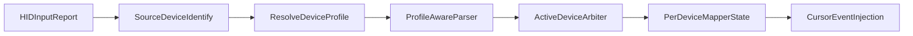

# XENEON EDGE + Multi-Device Touch Plan

## Goals

- Add first-class support for Corsair XENEON EDGE while preserving existing Webex Desk Pro behavior.
- Allow multiple touch devices to be connected simultaneously.
- Keep pointer control stable by enforcing one active controlling device at a time (auto arbitration + optional manual lock).
- Add a quick-win resolution diagnostic so users can compare logical vs native dimensions.

## Implementation Steps

- Introduce a device-profile layer and central matching helpers used by HID, parser, mapper, and diagnostics.
  - Add a new profile model (known VID/PID, touch limits, default ranges, right-edge compensation flag, name keywords).
  - Seed with profiles for Webex Desk Pro and Corsair XENEON EDGE.
- Refactor HID detection from single hardcoded VID/PID to multi-profile matching with source identity.
  - Keep all matching touch interfaces connected in a device registry keyed by stable identity.
  - Route each HID report with source metadata (`deviceID`) instead of anonymous touch reports.
- Make parsing profile-aware and device-aware.
  - Keep current Desk Pro parser logic unchanged for Desk Pro profile.
  - Add XENEON parser path/capability limit handling (5 max touches).
  - Ensure each emitted report includes source device identity.
- Add per-device mapping/calibration state.
  - Store separate mapper state per source device (touch range, calibration transform, edge compensation on/off).
  - Disable right-edge compensation for XENEON profile by default.
- Add active-device arbitration in gesture processing.
  - `Auto` mode: first touch claims control until all touches lift.
  - `Manual` mode: user-selected device lock can override auto.
  - Non-active devices remain connected but ignored for pointer injection.
- Expand screen targeting heuristics for known devices.
  - Keep existing display ID override precedence.
  - Add XENEON/CORSAIR name keywords to auto-detection path.
- Improve diagnostics for discovery and resolution quick-win.
  - Show all matched touch-capable devices and profile classification.
  - Report both logical frame and native pixel dimensions (where available) for each screen.
  - Include clear recommendation if logical/native mismatch may affect user expectations.

## Key Files to Update

- [TouchRedirect/Sources/TouchRedirect/HIDManager.swift](TouchRedirect/Sources/TouchRedirect/HIDManager.swift)
- [TouchRedirect/Sources/TouchRedirect/TouchParser.swift](TouchRedirect/Sources/TouchRedirect/TouchParser.swift)
- [TouchRedirect/Sources/TouchRedirect/Mapper.swift](TouchRedirect/Sources/TouchRedirect/Mapper.swift)
- [TouchRedirect/Sources/TouchRedirect/GestureEngine.swift](TouchRedirect/Sources/TouchRedirect/GestureEngine.swift)
- [TouchRedirect/Sources/TouchRedirect/ScreenManager.swift](TouchRedirect/Sources/TouchRedirect/ScreenManager.swift)
- [TouchRedirect/Sources/TouchRedirect/USBDiagnostics.swift](TouchRedirect/Sources/TouchRedirect/USBDiagnostics.swift)
- [TouchRedirect/Sources/TouchRedirect/Config.swift](TouchRedirect/Sources/TouchRedirect/Config.swift)
- New file: [TouchRedirect/Sources/TouchRedirect/TouchDeviceProfile.swift](TouchRedirect/Sources/TouchRedirect/TouchDeviceProfile.swift)

## Data-Flow Target

## Validation

- Verify Desk Pro path remains unchanged (regression check for connect, mapping, gestures).
- Verify XENEON connects, parses, maps to intended screen, and respects 5-touch limit.
- Verify two touch devices connected simultaneously:
  - Auto arbitration behaves as expected.
  - Manual lock overrides auto.
- Verify diagnostics output includes device classification and logical/native resolution details.

## Risks / Unknowns

- XENEON HID report layout and exact PID may require capture from your currently connected hardware.
- If report structure differs from assumptions, parser adaptation is required before full gesture parity.
- macOS pointer model is single-cursor, so concurrent device touches must remain serialized by arbiter.
